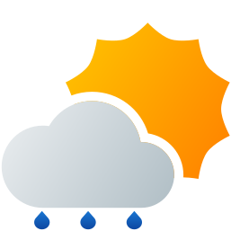

  
  <h1>Material Weather Icons</h1>

### About
A free and open source weather icon pack, designed to work well with Material Design components. While many icon packs are over simplified (e.g. Google's weather icons) these icons aim to strike a balance between simplicity and detail. They utilize large, flat shapes and the [Material Design color pallet](https://htmlcolorcodes.com/color-chart/material-design-color-chart/).
Forked from [M00NJ/material-weather-icons](https://github.com/M00NJ/material-weather-icons) and updated with complete day and night icon counterparts.

[//]: # "### Icons"

[//]: # ""

### License

 Material Weather Icons is licensed under [GPL V3](https://www.gnu.org/licenses/gpl-3.0.en.html#license-text).
